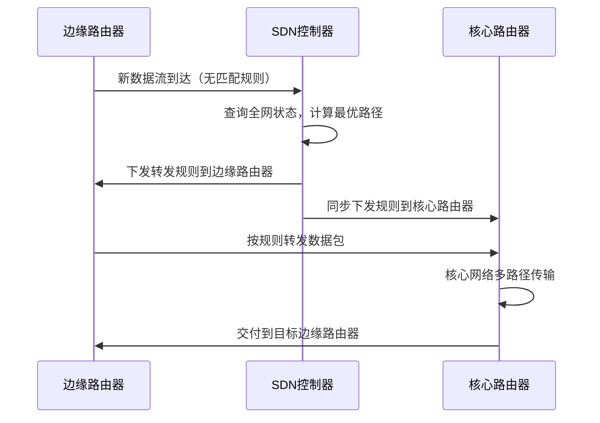

## 一、网络层的功能

网络层提供**主机到主机**的通信服务，主要任务是将分组经过多个网络和多段链路传输到目的主机。该任务可划分为**分组转发**和**路由选择**两种重要功能。

OSI参考模型曾主张在网络层使用面向连接的虚电路服务，认为应由网络自身来保证通信的可靠性。而TCP/IP体系的网络层提供的是无连接的数据报服务，其核心思想是应由用户主机来保证通信的可靠性。

在互联网采用的TCP/IP体系结构中，网络层向上只提供简单灵活的、无连接的、尽最大努力交付的数据报服务。也就是说，所传送的分组可能出错、丢失、重复、失序或超时，这就使得网络中的路由器可以做得比较简单，而且价格低廉。通信可靠性可以由更高层的传输层来负责。采用这种设计思路的好处是：网络的造价大大降低，运行方式灵活，能够适应多种应用。互联网能够发展到今日的规模，充分证明了当初采用这种设计思想的正确性。

### （一）异构网络互连

**网络互联**是指两个以上的计算机网络，通过一定的方法，用一些中继系统相互连接起来，以构成更大的网络系统。

互联网是由全球范围内数以万计的异构网络互联起来的，这些网络的拓扑结构、寻址方案、差错处理方法、路由选择机制等都不尽相同。将这些异构网络使用网络层中继系统实现互联便是网络层的一个重要的任务。

根据所在的网络层次，中继系统分为以下4种：

1. 物理层中继系统：转发器、集线器
2. 数据链路层中继系统：网桥或交换机
3. 网络层中继系统：路由器
4. 网络层以上的中继系统：网关

> 许多有关TCP/IP的文献也将网络层的路由器称为网关。

使用物理层和数据链路层的中继系统只是将网络的范围扩大，从网络层的角度来看仍运行着同一网络，不属于网络互联。因此**网络互联**通常是指用路由器进行网络连接和路由选择。路由器是一台专用计算机，用于在互联网中进行路由选择。

TCP/IP在网络层使用标准化的IP协议，使得异构网络之间使用路由器进行互连。参与互连的网络都使用IP协议，因此可以将互连后的网络称为虚拟IP网络。

虚拟互连网络也就是逻辑互连网络，指互连起来的各种物理网络的异构性是客观存在的，但是通过IP协议就可以使这些性能各异的网络在网络层上看起来是一个统一的网络。这种使用IP协议的虚拟互连网络可简称为IP网络。

使用IP网络的好处是：当IP网上的主机进行通信时，就好像在单个网络上通信一样，而看不见互连的各个网络的具体异构细节(如具体的编址方案、路由选择协议等)。

### （二）路由和转发

路由器主要完成两个功能：一是**路由选择**，即确定一条路径，二是**分组转发**，即当一个分组到达时所采取的动作。前者根据**路由选择协议**构造并维护路由表，后者处理通过路由器的数据流，关键操作是转发表查询、转发及相关的队列管理和任务调度等。

1. 路由选择：根据路由协议构造路由表，同时经常或定期地与相邻路由器交换信息，获取网络最新拓扑，动态更新维护路由表，以决定分组到达目的地结点的最优路径。
2. 分组转发：指路由器根据转发表将分组通过合适的端口转发出去。

路由表是根据路由选择算法得出的，而转发表是从路由表得出的。转发表的结构应当使查找过程最优化，路由表则需要最优化网络拓扑结构的计算。在讨论路由选择的原理时，一般不区分路由表和转发表，而笼统的使用路由表一词。

### （三）SDN 基本概念

网络层的主要任务是转发和路由选择。可以将网络层抽象地划分为**数据平面**(也称**转发平面**)和**控制平面**，转发是数据平面实现的功能，而路由选择是控制平面实现的功能。



软件定义网络(Software Defined Network, SDN)是近年流行的一种创新网络架构，它采用集中式的控制平面和分布式的数据平面，两个平面相互分离，控制平面使用**控制-数据接口**对数据平面上的路由器进行集中式的控制，方便软件来控制网络。传统网络中的路由器既有数据平面又有控制平面，由路由器之间相互通信来构造转发表，但是在SDN结构中，路由器不需要路由选择软件，因此路由器之间不需要相互交换信息。在网络的控制平面有一个逻辑上的远程控制器(可有多个服务器组成)。远程控制器掌握各主机和整个网络的状态，为每个分组计算出最佳路由，通过Openflow协议(或其他途径)将转发表(在SDN中称为**流表**)下发给路由器。路由器的工作简化为接收分组、查找转发表、转发分组。

这样SDN又将网络定义成集中控制结构，而互联网本来是分布式的，因此不可能在整个互联网范围内使用SDN。然而，在某些具体条件下，例如在大型数据中心之间使用的广域网，使用SDN来建造，可以使网络的运行效率更高。

SDN的可编程性通过为开发者提供强大的编程接口，使得网络具有很好的编程性。

1. 北向接口：针对上层应用开发者，提供了一系列丰富的API，开发者可以在此基础上设计自己的应用，而不必关心底层的硬件细节。
2. 南向接口：用于SDN控制器和转发设备建立双向会话，通过不同的南向接口协议(如Openflow)，SDN控制器就可以兼容不同的硬件设备，同时在设备中实现上层应用的逻辑。
3. 东西向接口：SDN控制器集群内部的控制器之间的通信接口，用于增强整个控制平面的可靠性和可拓展性。

优点：

1. 全局集中式控制和分布式高速转发，即有利于控制平面的全局优化，又利于高性能的网络转发
2. 灵活可编程与性能的平衡，控制和转发功能分离后，使得网络可以由专有的自动化工具以编程方式配置
3. 降低成本，控制与数据平面分离后，尤其在使用开放接口协议后，就实现了网络设备的制造与软件功能的开发相分离，从而有效降低了成本。

缺点：

1. 安全风险，集中管理容易受攻击，若崩溃则整个网络会受到影响。
2. 瓶颈问题，原本分布式的控制平面集中化后，随着网络规模的扩大，控制器可能成为网络性能的瓶颈。

### （四）阻塞控制

因出现过量的分组而引起网络性能下降的现象称为**拥塞**。判断网络是否进入拥塞的方法是：观察网络的吞吐量与网络负载的关系，若随着网络负载的的增加，网络的吞吐量明显小于正常的吞吐量，则网络可能已进入轻度拥塞状态；若网络的吞吐量随着网络负载的增大而下降，则网络就可能已进入拥塞状态。拥塞控制主要解决的问题是如何获取网络中发生拥塞的信息，从而利用这些信息进行控制，以避免因拥塞出现的分组丢失。

拥塞控制的作用：确保网络能够承载所达到的流量，这是一个全局性的过程，涉及网络中所有的主机、路由器及导致网络传输能力下降的所有因素。单一地增加资源并不能解决拥塞。

与流量控制的区别：流量控制往往是指在发送方和接收方之间的点对点通信量的控制。流量控制要做的是抑制发送方发送数据的速率，以便接收方来得及接受。

拥塞控制的方法有两种：

1. 开环控制：在设计网络时事先将有关发生拥塞的因素考虑周到，力求网络在工作时不产生拥塞。这是一种静态的预防方法。且整个系统启动并运行，中途就不再需要修改。开环控制手段包括确定何时可接收新流量、何时可丢弃分组及丢弃哪些分组，确定何种调度策略等。所有这些手段的共性是，在做决定时不考虑当前网络的状态。
2. 闭环控制：事先不考虑有关发生拥塞的各种因素，采用监测网络系统去监视，及时检测哪里发生了拥塞，然后将拥塞信息传到合适的地方，以便调整网络系统的运行，并解决出现的问题。闭环控制是基于反馈环路的概念，是一种动态的方法。

## 二、路由算法

### （一）静态路由与动态路由

### （二）距离-向量路由算法

### （三）链路状态路由算法

### （四）层次路由

## 三、IPv4

### （一）IPv4 分组

### （二）IPv4 地址与 NAT

### （三）子网划分、路由聚集、子网掩码与 CIDR

#### 1. 子网划分

#### 2. 路由聚集

#### 3. 子网掩码

#### 4. CIDR

### （四）ARP 协议、DHCP 协议与 ICMP 协议

#### 1.ARP协议

#### 2. DHCP协议

#### 3. ICMP协议

## 四、IPv6

### （一）Ipv6 的主要特点

### （二）IPv6 地址

## 五、路由协议

### （一）自治系统

### （二）域内路由与域间路由

### （三）RIP 路由协议

### （四）OSPF 路由协议

### （五）BGP 路由协议

## 六、IP组播

### （一）组播的概念

### （二）IP 组播地址

## 七、移动 IP

### （一）移动 IP 的概念

### （二）移动 IP 的通信过程

## 八、网络层设备

### （一）路由器的组成和功能

### （二）路由表与分组转发
