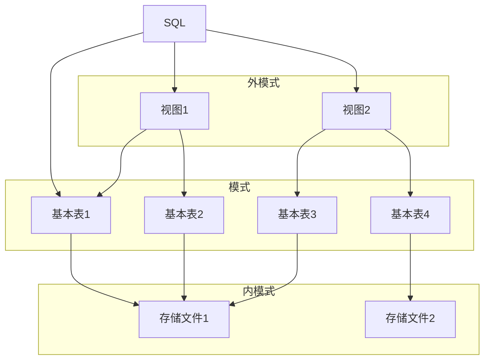

## 三、关系数据库标准语言SQL

### 3.1 SQL概述

SQL（Structured Query Language）即结构化查询语言，是关系数据库的标准语言。SQL是一个通用的、功能极强的关系数据库语言。

#### 3.1.1 SQL 的产生与发展

| 标准 | 大致页数 | 发布日期 |
| ---  | -------- | -------- |
| SQL/86 |  | 1986.10 |
| SQL/89（FIPS 127-1） | 120页 | 1989年|
| SQL/92 | 622页 | 1992年 |
| SQL99（SQL 3） | 1700页 | 1999年 |
| SQL2003 | 3600页 | 2003年 |
| SQL2008 | 3777页 | 2006年 |
| SQL2011 |  | 2010年 |

目前，没有一个数据库系统能够支持SQL标准的所有概念和特性.

#### 3.1.2 SQL的特点

1. 综合统一
2. 高度非过程化
3. 面向集合的操作方式
4. 以同一种语法结构提供多种使用方式
5. 语言简洁，易学易用

##### 1. SQL特点：综合统一

- 集数据定义语言（DDL），数据操纵语言（DML），数据控制语言（DCL）功能于一体。
- 可以独立完成数据库生命周期中的全部活动：
  - 定义关系模式，插入数据，建立数据库；
  - 对数据库中的数据进行查询和更新；
  - 数据库重构和维护
  - 数据库安全性、完整性控制等
- 用户数据库投入运行后，可根据需要随时逐步修改模式，不影响数据的运行。
- 数据操作符统一（数据结构：关系）

##### 2. SQL特点：高度非过程化

- 非关系数据模型的数据操纵语言“**面向过程**”，必须制定存取路径
- SQL只要提出“**做什么**”，无须了解存取路径。
- 存取路径的选择以及SQL的操作过程由**系统自动完成**。
- 4GL：面向问题，描述性语言

##### 3. SQL特点：面向集合的操作方式

- 非关系数据模型采用面向记录的操作方式，操作对象是一条记录
- SQL采用集合操作方式
  - 操作对象、查找结果可以是元组的集合
  - 一次插入、删除、更新操作的对象可以是元组的集合

##### 4. SQL特点：同一种语法结构，多种使用方式

- SQL是独立的语言
  - 能够独立地用于联机交互的使用方式
- SQL又是嵌入式语言
  - SQL能够嵌入到高级语言（例如C，C++，Java）程序中，供程序员设计程序时使用

##### 5. SQL特点：语言简介，易学易用

SQL功能极强，完成核心功能只用了9个动词。

| SQL 功能 | 动词 |
| -------- | ---- |
| 数据查询 | SELECT |
| 数据定义 | CREATE，DROP，ALTER |
| 数据操纵 | INSERT，UPDATE DELETE |
| 数据控制 | GRANT，REVOKE |

#### 3.1.3 SQL的基本概念

SQL语言支持关系数据库三级模式结构

- 外模式：视图（View）和部分基本表（Base table）
- 模式：若干基本表（Base table）
- 内模式：存储文件（stored file）



### 3.2 数据定义

- 基本表
  - 本身独立存在的表，关系表，是**实表**
  - SQL中一个关系就对应一个基本表
  - 一个(或多个)基本表对应一个存储文件
  - 一个表可以带若干索引
- 存储文件
  - 逻辑结构组成了关系数据库的内模式
  - 物理结构是任意的，**对用户透明**
- 视图
  - 从一个或几个基本表导出的表
  - 数据库中只存放视图的定义而不存放视图对应的数据
  - 视图是一个**虚表**
  - 用户可以在视图上再定义视图
  - 例如，查询语句执行之后的结果

<table>
  <thead>
    <tr>
      <th rowspan="2" style="text-align: center;">操作对象</th>
      <th colspan="3" style="text-align: center;">操作方式</th>
    </tr>
    <tr>
      <th style="text-align: center;">创建</th>
      <th style="text-align: center;">删除</th>
      <th style="text-align: center;">修改</th>
    </tr>
  </thead>
  <tbody>
    <tr>
      <td style="text-align: center;">模式</td>
      <td style="text-align: center;">CREATE SCHEMA</td>
      <td style="text-align: center;">DROP SCHEMA</td>
      <td style="text-align: center;"></td>
    </tr>
    <tr>
      <td style="text-align: center;">表</td>
      <td style="text-align: center;">CREATE TABLE</td>
      <td style="text-align: center;">DROP TABLE</td>
      <td style="text-align: center;">ALTER TABLE</td>
    </tr>
    <tr>
      <td style="text-align: center;">视图</td>
      <td style="text-align: center;">CREATE VIEW</td>
      <td style="text-align: center;">DROP VIEW</td>
      <td style="text-align: center;"></td>
    </tr>
    <tr>
      <td style="text-align: center;">索引</td>
      <td style="text-align: center;">CREATE INDEX</td>
      <td style="text-align: center;">DROP INDEX</td>
      <td style="text-align: center;">ALTER INDEX</td>
    </tr>
  </tbody>
</table>

#### 3.3.0 数据类型

- SQL中域的概念用数据类型来实现
- 定义表的属性时 需要指明其数据类型及长度
- 选用哪种数据类型
  - 取值范围
  - 要做哪些运算

| 数据类型                | 含义                                                         |
|-----------------------|------------------------------------------------------------|
| CHAR(n), CHARACTER(n) | 长度为n的定长字符串                                               |
| VARCHAR(n), CHARACTERVARYING(n) | 最大长度为n的变长字符串                                             |
| CLOB                  | 字符串大对象                                                     |
| BLOB                  | 二进制大对象                                                     |
| INT, INTEGER          | 长整数（4字节）                                                  |
| SMALLINT              | 短整数（2字节）                                                  |
| BIGINT                | 大整数（8字节）                                                  |
| NUMERIC(p, d)         | 定点数，由p位数字（不包括符号、小数点）组成，小数后面有d位数字                         |
| DECIMAL(p, d), DEC(p, d) | 同NUMERIC                                                      |
| REAL                  | 取决于机器精度的单精度浮点数                                             |
| DOUBLE PRECISION      | 取决于机器精度的双精度浮点数                                             |
| FLOAT(n)              | 可选精度的浮点数，精度至少为n位数字                                         |
| BOOLEAN               | 逻辑布尔量                                                       |
| DATE                  | 日期，包含年、月、日，格式为YYYY-MM-DD                                    |
| TIME                  | 时间，包含一日的时、分、秒，格式为HH:MM:SS                                  |
| TIMESTAMP             | 时间戳类型                                                       |
| INTERVAL              | 时间间隔类型                                                       |


#### 3.3.1 模式的定义与删除

##### 1. 定义模式

<p><strong>CREATE SCHEMA</strong> <i>&lt;模式名&gt;</i> <strong>AUTHORIZATION</strong> <i>&lt;用户名&gt;</i>;</p>
<p>[ <i>&lt;表定义子句&gt;</i> | <i>&lt;视图定义子句&gt;</i> | <i>&lt;授权定义子句&gt;</i> ]</p>

- 如果没有指定<模式名>，隐含为<用户名>
- 调用该命令的用户必须拥有DBA权限，或者获得DBA授予的CREATE SCHEMA权限
- 定义模式实际上定义了一个命名空间
  - 在这个空间中可以定义该模式包含的数据库对象，例如基本表、视图、索引等。
  - 在CREATE SCHEMA中可以接受CREATE TABLE，CREATE VIEW和GRANT子句

##### 2. 删除模式

<p><strong>DROP SCHEMA</strong> <i>&lt;模式名&gt;</i> <strong>&lt;CASCADE|RESTRICT&gt;</strong> ;</p>

- CASCADE(级联)
  - 删除模式的同时把该模式中所有的数据库对象全部删除
- RESTRICT(限制)
  - 如果该模式中定义了下属的数据库对象（如表、视图等），则拒绝该删除语句的执行。
  - 当该模式中没有任何下属的对象时 才能执行。

#### 3.3.2 基本表的定义、删除与修改

##### 1. 定义基本表

<p><strong>CREATE TABLE</strong> &lt;表名&gt; <br>
&nbsp;&nbsp;&nbsp;&nbsp;&nbsp;&nbsp;&nbsp;&nbsp;
(&lt;列名&gt;&lt;数据类型&gt;[&nbsp;&lt;列级完整性约束条件&gt;&nbsp;]<br>
&nbsp;&nbsp;&nbsp;&nbsp;&nbsp;&nbsp;&nbsp;&nbsp;
[ , &lt;列名&gt;&lt;数据类型&gt;[&nbsp;&lt;列级完整性约束条件&gt;&nbsp;] ]<br>
...
[，&lt;表级完整性约束条件&gt; ] ) ;</p>

- <表名>：所要定义的基本表的名字
- <列名>：组成该表的各个属性（列）
- <列级完整性约束条件>：涉及相应属性列的完整性约束条件
- <表级完整性约束条件>：涉及一个或多个属性列的完整性约束条件

如果完整性约束条件涉及到该表的多个属性列，则必须定义在表级上，否则既可以定义在列级也可以定义在表级

执行CREATE TABLE语句后：
- 有关表的定义、约束条件定义等翻译成内部表、存储在系统
的数据字典中
- 数据库为基本表分配了（预留了）存储空间

##### 2. 模式与表

- 每一个基本表都属于某一个模式
- 一个模式包含多个基本表
- 定义基本表所属模式
  - 方法一：在表名中明显地给出模式名
    - Create table ` S-T `.Student（......）; /*模式名为 S-T*/
    - Create table ` S-T `.Cource（......）;
    - Create table ` S-T `.SC（......）;
  - 方法二：在创建模式语句中同时创建表
  - 方法三：设置所属的模式
    - 例如Use `S-T`;

- 创建基本表（其他数据库对象也一样）时，若没有指定模式，系统根据搜索路径来确定该对象所属的模式
- RDBMS会使用模式列表中第一个存在的模式作为数据库对象的模式名
- 若搜索路径中的模式名都不存在，系统将给出错误
- 显示当前的搜索路径： SHOW search_path;
  - 搜索路径的当前默认值是：$user， PUBLIC。其含义是首先搜索与用户名相同的模式名，如果该模式名不存在，则使用PUBLIC模式。
- DBA用户可以设置搜索路径，然后定义基本表

例如

```sql
SET search_path TO “S-T”，PUBLIC；
Create table Student（......）; 
```

结果建立了S-T.Student基本表。RDBMS发现搜索路径中第一个模式名S-T存在，就把该模式作为基本表Student所属的模式。

> 有些DBMS，如MYSQL，SQL SERVER，ORACLE，没有搜索路径的概念。